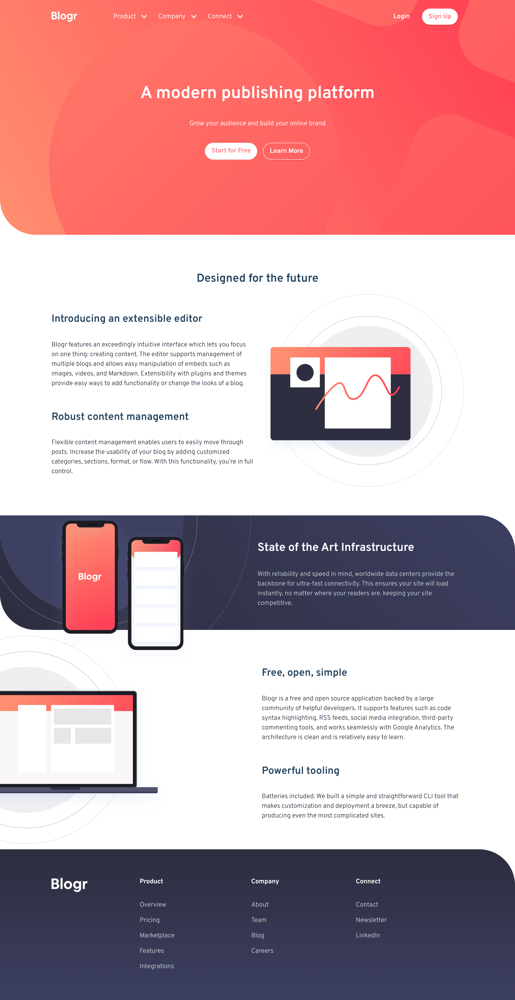

# Frontend Mentor - Blogr landing page solution

This is a solution to the [Blogr landing page challenge on Frontend Mentor](https://www.frontendmentor.io/challenges/blogr-landing-page-EX2RLAApP). Frontend Mentor challenges help you improve your coding skills by building realistic projects.

## Table of contents

- [Overview](#overview)
  - [The challenge](#the-challenge)
  - [Screenshot](#screenshot)
  - [Links](#links)
- [My process](#my-process)
  - [Built with](#built-with)
- [Author](#author)
- [Acknowledgments](#acknowledgments)

## Overview

### The challenge

The challenge is to build out this landing page and get it looking as close to the design as possible.

Users should be able to:

- View the optimal layout for the site depending on their device's screen size
- See hover states for all interactive elements on the page

### Screenshot

### Links

- Solution URL: [https://www.frontendmentor.io/solutions/blogr-landing-page](https://www.frontendmentor.io/solutions/blogr-landing-page)
- Live Site URL: [https://amansgz.github.io/blogr-landing-page](https://amansgz.github.io/blogr-landing-page)

## My process

### Built with

- Semantic HTML5 markup
- BEMMethodology
- CSS custom properties
- Flexbox
- Mobile-first workflow

## Author

- Frontend Mentor - [@amansgz](https://www.frontendmentor.io/profile/amansgz)
- Github - [@amansgz](https://github.com/amansgz)
